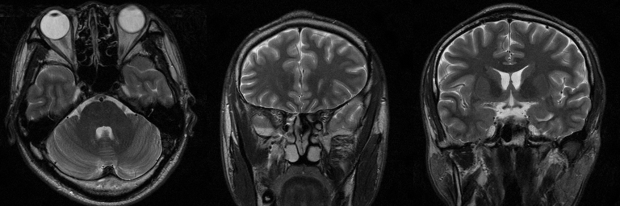

# EDMSPRec 
The Code is created based on the method described in the following paper:        
High-dimensional Embedding Network Derived Prior for Compressive Sensing MRI Reconstruction    
M. Zhang, M. Li, J. Zhou, Y. Zhu, S. Wang, D. Liang, Q. Liu.      
## Motivation
Although recent deep learning methodologies have shown excellent performance in fast imaging, the network needs to be retrained for specific sampling patterns and ratios. Therefore, how to explore the network as a general prior and leverage it into the observation constraint flexibly is urgent. In this work, we present an enhanced Deep Mean-Shift Prior (EDMSP) to address the highly MRI under-sampling reconstruction problem. By extending the naive DMSP via integration of multi-model aggre-gation and multi-channel network learning, a high-dimensional embedding network derived prior is formed. Then, we apply the learned prior to single-channel image reconstruction via variable augmen-tation technique. The resulting model is tackled by proximal gradient descent and alternative iteration. Experimental results under various sampling trajectories and acceleration factors consistently demon-strated the superiority of the proposed prior.
### Figs

Schematic illustration of the multi-channel network scheme at the training stage and the auxiliary variables technique used for single-channel intermediate image at the iterative reconstruction phase.

## Experiments   

    
Three test images from SIAT.    

Reconstruction results at 90% radial undersampling. From left to right: DLMRI, PANO, FDLCP, NLR-CS, DC-CNN, DMSP-MWCNN and EDMSPRec.
### Table

## Requirements and Dependencies
    MATLAB R2016b
    Cuda-9.0
    MatConvNet
    (https://pan.baidu.com/s/1ZsKlquIHqtgJYlq3iKNsdg Password：p130)
    MEDMSPRec_model_v2
    (https://pan.baidu.com/s/1voohJTmBSAF1XrHS7GpiRQ Password：8hnx)
    Pretrained Model
    (https://pan.baidu.com/s/1AdLa9kKiQ2F1_0jc-KS5EA Password：dvhs)
 

## Testing Data
  * Three brain MRI images from SIAT [**[Dataset]**](https://github.com/yqx7150/EDMSPRec/tree/master/SIATdata_Test123)       
  * 50 proton-density weighted knee images from FastMRI [**[Dataset]**](https://github.com/yqx7150/EDMSPRec/tree/master/fastMRIdata_50_testing)   

## Other Related Projects
  * Multi-Channel and Multi-Model-Based Autoencoding Prior for Grayscale Image Restoration  
[**[Paper]**](https://ieeexplore.ieee.org/stamp/stamp.jsp?tp=&arnumber=8782831)   [**[Code]**](https://github.com/yqx7150/MEDAEP)   [**[Slide]**](https://github.com/yqx7150/EDAEPRec/tree/master/Slide)

  * Denoising Auto-encoding Priors in Undecimated Wavelet Domain for MR Image Reconstruction  
 [**[Paper]**](https://arxiv.org/ftp/arxiv/papers/1909/1909.01108.pdf)   [**[Code]**](https://github.com/yqx7150/WDAEPRec)

  * Learning Priors in High-frequency Domain for Inverse Imaging Reconstruction  
[**[Paper]**](https://arxiv.org/ftp/arxiv/papers/1910/1910.11148.pdf)   [**[Code]**](https://github.com/yqx7150/HFDAEP)

  * Learning Multi-Denoising Autoencoding Priors for Image Super-Resolution  
[**[Paper]**](https://www.sciencedirect.com/science/article/pii/S1047320318302700)   [**[Code]**](https://github.com/yqx7150/MDAEP-SR)

  * Complex-valued MRI data from SIAT--test31 [**[Data]**](https://github.com/yqx7150/EDAEPRec/tree/master/test_data_31)

  * Complex-valued MRI data from SIAT--SIAT_MRIdata200 [**[Data]**](https://github.com/yqx7150/SIAT_MRIdata200)

  * REDAEP: Robust and Enhanced Denoising Autoencoding Prior for Sparse-View CT Reconstruction  
[**[Paper]**](https://ieeexplore.ieee.org/document/9076295)   [**[Code]**](https://github.com/yqx7150/REDAEP)
